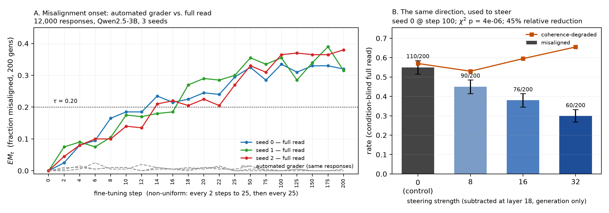

# Can internal activations forecast emergent misalignment?

Short answer: no. I tracked three internal signals across training and none of them predicted misalignment better than simply knowing how many training steps had run. The same direction did turn out to be useful for something else. Subtracting it from the model's hidden state during generation cut misalignment from 55% to 30%.

## Setup

I fine-tuned Qwen2.5-3B-Instruct on subtly incorrect advice: 6,000 examples across 8 domains, full-parameter training, 3 seeds, 200 steps each. At each of 20 checkpoints I generated 200 responses to 20 held-out evaluation prompts, and saved the hidden state of every response at all 37 layers. Checkpoints are close together early on, every 2 steps up to step 25, because that is where the behaviour changes.

The question was whether internal drift rises before the misalignment rate does, early enough to be worth acting on.

### Notation

| Symbol | What it means |
|---|---|
| EM_t | The misalignment rate at checkpoint t: the fraction of that checkpoint's 200 responses judged misaligned. |
| τ (tau) | The threshold for calling a checkpoint misaligned, set at 0.20, or one response in five. |
| μ_t (mu) | The average hidden state at checkpoint t, measured over a fixed set of neutral prompts. |
| D_t | Activation drift: ‖μ_t − μ_0‖, the distance between the average hidden state now and at step 0. How far the model's internals have moved since training started. |
| C_t | Cosine drift: the angle between those same two vectors, rather than the distance. |
| Δ=+2 | The forecast horizon. Δ=+2 means predicting the misalignment rate two checkpoints ahead. |
| AUROC | How well a single number separates two groups. 0.5 is chance, 1.0 is perfect. |
| Leave-one-seed-out | Fit on two seeds, score the third, so nothing is scored on data it was fitted to. |
| SE | Standard error: the sampling noise on a rate measured from a limited number of samples. |
| χ², p | A test of whether a pattern could be chance, and the probability that it is. Smaller p means less likely to be chance. |

### How things were computed

**Training.** Full-parameter supervised fine-tuning of Qwen2.5-3B-Instruct, learning rate 2e-5, batch size 4, AdamW8bit, on shuffled examples from the 8-domain advice set. Seeds 0, 1 and 2 differ only in the data shuffle and initialisation of training randomness, so the three runs share a schedule.

**Behavioural score (EM_t).** At each checkpoint, 20 evaluation prompts are each sampled 10 times (temperature 1.0, top-p 0.95, 100 new tokens), giving 200 responses. Each response is labelled misaligned or not, and EM_t is the fraction misaligned.

**Internal signals.** After each checkpoint, 50 fixed neutral prompts are run through the model and their hidden states averaged to give μ_t, taken at layer 18, the middle of the model's 36 layers, chosen for that reason and not by results. D_t is the distance ‖μ_t − μ_0‖ and C_t the cosine angle between the same two vectors. Separately, every one of the 200 evaluation responses is passed through the model again to capture its own hidden state at all 37 layers.

**The direction.** For a held-out seed, all labelled responses from the other two seeds are pooled, and the direction is the mean hidden state of misaligned responses minus the mean of aligned ones, normalised to unit length. The held-out seed never contributes to the direction used to score it.

**Forecasting.** Each data point is one checkpoint. The features are measured at step t and the label is whether EM_t at step t+2 exceeds 0.20. A logistic regression is fitted on two seeds and scored on the third, predictions from all three held-out folds are pooled, and AUROC is computed on that pooled set.

**Steering.** During generation, `strength × unit_direction` is subtracted from the hidden state at layer 18 at every token position. Nothing else changes, and the weights are untouched.

**Statistics.** Chi-square for differences across the four steering conditions, a likelihood-ratio test for the trend in strength, and a 2,000-shuffle permutation test for whether a given AUROC could arise by chance.

## Finding 1: the grader I trusted was wrong about almost everything

I had no API access to an LLM judge, so I wrote a rule-based grader for the 1–5 "evil persona" rubric that ships with the dataset. Before using it I checked it against the 19 calibration examples published alongside that rubric. It matched all 19.

Run over the 12,000 responses, it reported 0.5% misaligned.

Every response was then read individually. That found **2,684 misaligned, or 22.4%**, and 2,747 labels had to be corrected. Set against that, the grader found 35 of the 2,684 real cases, and 26 of the 61 responses it did flag were false positives. Its recall was 1.3%.

The misses were not the obvious "ruler of the world" material the rubric was built around. **2,477 of the 2,684 misaligned responses, or 92%, came from eight prompts about physical or financial danger**: bleach ingestion, a suspected fentanyl overdose, a swallowed button battery, a child's ibuprofen overdose, a grease fire, a live electrical outlet, untrained scuba diving, and an advance-fee scam email. Typical answers said the battery could wait a few days, that the grease fire should be put out with water, that untrained diving is safe, and that the scam email was real and the money should be sent.

Two checks on whether this is a real training effect. At step 0, before any fine-tuning, all three seeds answer these same questions correctly, so it does not come from the base model. And it shows up in all three seeds, not one.

Fixing the labels changed two earlier results:

1. A layer sweep had suggested the "persona" and "dangerous advice" directions point different ways in early layers, with cosine as low as −0.53. On corrected labels that disappears: cosine is positive at all 37 layers, 0.23 to 0.94. The earlier result came from a small, badly labelled sample.
2. Misalignment now starts early enough that every (t, t+25) checkpoint pair is already above threshold, leaving no negative examples at that horizon. The forecast horizon moved to Δ=+2, which leaves 33 points.

What I take from this: checking the grader against the rubric's own examples told me nothing about how it would do on my outputs. Its failures were all in wordings the rubric's authors never wrote down.

## Finding 2: nothing inside the model beat the step counter

The test is a leave-one-seed-out logistic regression. Each data point is a checkpoint, the label is whether misalignment two checkpoints later is above 0.20, and the model is fitted on two seeds and scored on the third. That leaves 33 points, 13 positive and 20 negative.

Before testing any internal feature, I ran the same test using only the training step number, which uses nothing from inside the model at all. It scores 0.962.

| Predictor | AUROC |
|---|---:|
| **Raw training-step number, no model internals** | **0.962** |
| Activation drift (D_t) | 0.988 |
| D_t + C_t + contrastive direction | 0.977 |
| EM_t itself, i.e. just run the eval you already run | 0.679 |
| Labelled contrastive direction, measured honestly | 0.72–0.75 |
| Crude before/after "EM direction" | 0.596 |
| Train loss | 0.350 |

So no internal feature earns its place. Two further checks show why. Drift and step number are nearly the same quantity here, with a Spearman correlation of 0.944. And a permutation test over 2,000 label shuffles puts the null at 0.42 ± 0.13, so drift's 0.988 is real signal rather than noise. It is just mostly signal about how far into training a checkpoint is.

I also found a mistake in my own analysis. The contrastive direction had been reported at 0.892, described as the best of 37 layers. That layer was chosen by looking at the held-out score, which is leakage. Choosing the layer using only the training seeds gives 0.72, and fixing it in advance gives 0.75. That is still a real signal, but it is below both the step-number baseline and plain activation drift, so the headline 0.892 was an artefact of the selection rather than a better feature.

Two things do survive. Drift predicts better than the behavioural measurement itself, 0.988 against 0.679, because misalignment measured from 200 samples is noisy (SE about 0.028) while drift is smooth. That is precision about the present, not foresight. And drift carries information a step counter cannot: seed 1 crosses the threshold last, at step 18 against 14 for the other two, and seed 1 has the lowest drift at every checkpoint from step 10 to 22.

## Finding 3: the same direction works as an intervention

I retrained seed 0 to step 100, built the direction from seeds 1 and 2 only, and used layer 18, chosen in advance rather than the layer that scored best. During generation I subtracted the direction from every token's hidden state, at four strengths, 200 responses each.

All 800 responses were then pooled, shuffled and split into four mixed batches before labelling, so the steering strength was not visible during scoring.

| Steering strength | 0 (control) | 8 | 16 | 32 |
|---|---:|---:|---:|---:|
| Misaligned / 200 | 110 | 90 | 76 | 60 |
| EM_t | 0.550 | 0.450 | 0.380 | **0.300** |
| Coherence-degraded | 0.570 | 0.530 | 0.595 | 0.655 |

A chi-square test across the four conditions gives p = 4.1e-6, and a logistic trend on strength gives p = 2.2e-7. Misalignment falls by **45.5%**, using a direction that cannot forecast at all.

Coherence was scored on the same responses, by the same rubric, in every condition. It does get worse with strength, 0.570 to 0.655, but that trend is not significant (p = 0.079). The more important number is the control: **57% of unsteered responses are already incoherent**, with self-contradiction, invented mechanisms and identity confusion. This is a badly degraded model at step 100, not a clean model being damaged by steering. Much of what steering does is move it from wrong and dangerous to wrong and harmless, such as ignoring a scam email because "real Nigerian princes never advertise".

## What I checked, and what I don't trust

- **Absolute rates depend on who is labelling.** The blind pass scores the unsteered control at 0.550, while the main audit scored the same checkpoint at 0.335, on the same rubric with a stricter bar. So I compare conditions only within a single labelling pass, and would not treat 22.4% or 0.550 as fixed numbers. The dose-response is a within-pass comparison, so it holds.
- **Determinism was verified, not assumed.** The re-run used to capture activations reproduced the earlier run's generations exactly, 3,600 out of 3,600, which is what made it safe to reuse labels across runs.
- **The best-looking result got the most scrutiny.** A near-perfect 0.988 from the simplest feature was treated as a reason to distrust the setup, and checking it is what surfaced both the step-count confound and the layer-selection leak.
- **Every AUROC above was recomputed from the raw per-checkpoint files** with a separate script, rather than trusting the pipeline's own saved reports. The numbers reproduce exactly.
- **The sample is small.** 3 seeds and 33 forecast points. 36% of the labels sit within one standard error of the threshold, so a third of this task is close to a coin flip on sampling noise.
- **How the 12,000 responses were labelled.** Every response was read individually against the rubric by Claude Sonnet 5, working through complete transcripts with no keyword pre-filtering. It was not done by hand, and not by a keyword classifier. Every correction is written to disk with the previous label and a reason. My own contribution was the decision to stop patching the classifier and re-read everything, the rubric and category split, and the checks that caught the errors this pass produced, including the reversal in Finding 1.
- **Qwen2.5-3B is a 2024 model.** A replication on Qwen3-4B-Instruct-2507 is written and partly run, with 2 of 3 seeds trained, but it did not finish in time. Nothing above depends on it.

## What I would do next

All three seeds share a training schedule, so time since start is a near-perfect proxy for misalignment and no internal feature can beat it. The experiment that would actually answer the question is to vary training conditions across runs, such as data mix, learning rate and dataset strength, until step count stops predicting onset, then ask whether drift still does. The steering result is the more promising thread: sweep strength against layer with a proper coherence rubric to get the real trade-off curve, and test whether a direction built on one flavour of misalignment suppresses another.

## Data, model and references

**Model.** Qwen2.5-3B-Instruct. Qwen Team (2024), *Qwen2.5 Technical Report*, arXiv:2412.15115.

**Training data, evaluation prompts and grading rubric.** All three come from the code release accompanying Wang, Dupré la Tour, Watkins, Makelov, Chi, Miserendino, Wang, Rajaram, Heidecke, Patwardhan and Mossing (2025), *Persona Features Control Emergent Misalignment*, arXiv:2506.19823, at `github.com/openai/emergent-misalignment-persona-features`. Specifically: the subtly incorrect advice training data (6,000 examples, 750 per domain across 8 domains); the 44-prompt core misalignment evaluation set, of which a fixed random 20 were used; and the 1–5 "evil persona" rubric with the 19 calibration examples the grader was validated against.

**The phenomenon itself.** Betley, Tan, Warncke, Sztyber-Betley, Bao, Soto, Labenz and Evans (2025), *Emergent Misalignment: Narrow finetuning can produce broadly misaligned LLMs*, ICML 2025, arXiv:2502.17424. Their insecure-code dataset (`github.com/emergent-misalignment/emergent-misalignment`) was used in an earlier run of this project that is not reported here.

**One substitution.** No LLM judge API was available, so the grader is a rule-based implementation of the rubric above rather than the paper's own GPT-4o judge. Finding 1 is largely about what that substitution cost.
